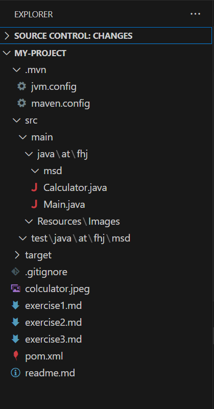

1️⃣ Initialize Git Repository
1️⃣ Initialize Git Repository
2️⃣ Create a New Maven Project
3️⃣ Verify Project Structure
4️⃣ Modify .gitignore
1️⃣ Initialize Git Repository
2️⃣ Create a New Maven Project
3️⃣ Verify Project Structure
4️⃣ Modify .gitignore
5️⃣ Commit and Push Project to GitHub
6️⃣ Create exercise3.md File
## Projektstruktur
Screenshot of  Projectstruktur:

changes in pom.xml

