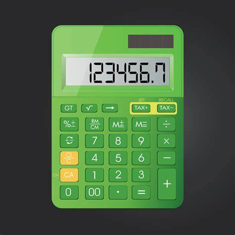

# Simple Java Calculator




You can find the online version in this link: <https://www.calculator.net/>

This repository contains a basic **Java Calculator** consisting of an interface (`ICalculator`) and its implementation (`CalculatorImpl`). It supports the four fundamental arithmetic operations: **addition**, **subtraction**, **multiplication**, and **division**. The code is intended for **educational** and **test automation** purposes.

---

## Overview

- **Interface**: `ICalculator`
  - Declares the methods `add`, `minus`, `divide`, and `multiply`.
- **Implementation**: `CalculatorImpl`
  - Implements the methods defined in the interface.
  - Provides a simple mechanism to handle invalid divisions (division by zero triggers an `ArithmeticException`).

---

## Features

1. **Addition (`add`)**  
   ```java
   double result = calc.add(3.5, 2.0); // returns 5.5
   ```
### Exercise 2
[Exercise 2](exercise2.md) - This exercise focuses on [brief description of the topic].
[exercise3](exercise3.md)- This exercise focusee on Maven and Java packages.